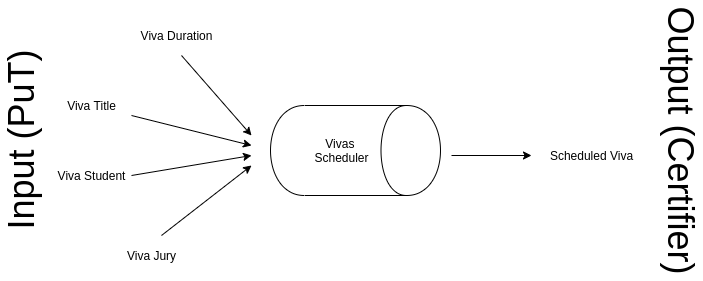
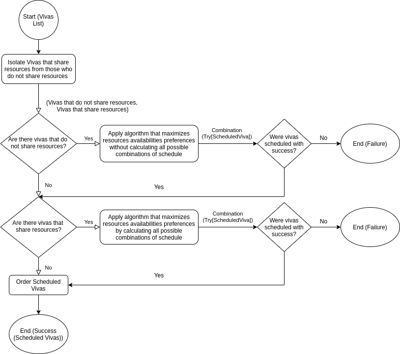

# Vivas Schedule

This repository holds the documentation and code of the project developed for TAP (Técnicas Avançadas de Programação) curricular unit of MEI (Mestrado em Engenharia Informática) at ISEP (Instituto Superior de Engenharia do Porto). It addresses the topic of the scheduling of MSc Disseration Defenses (entitled as Vivas) based on the availability of the jury participants (referenced as resources), following the functional programming paradigm.

The development was divided in three milestones, being the first one an MVP implementation of the scheduling algorithm, the second one the assurance of the domain correctness with the use of property-based tests and the third one, a refinement to the scheduling algorithm with scheduling preference maximization. Additionality, coding guidelines were also defined in order to control the quality of the code and facilitate the communication between developers.

## Milestones Development Process

The next sections will explain in detail topics such as the coding guidelines imposed in the project to promote the code quality and readness by the current and future developers, the established domain and how functional design was adopted to certify it in the code, how input files are parsed, how each scheduling algorithm is designed and works as well how property based testing was tackled.

### MS01
The first milestone was developed under the Test Driven Development approach (TDD). Since this was the beginning of the project, every domain model concept was still under development, and the code base was non existent.
In order to ensure a good development and preventing the maximum amount of bugs since the first moment, we first wrote unit tests that would ensure the correctness of our domain model. Only after have the tests written, we started the development of the first come first served algorithm.
This approach helped us to prevent for some bug that might have shown up later in the project.
Writing the unit tests first definitely helped to clarify what we wanted from the code to do. 
Having a reasonable amount of unit tests present in the project would also prevent collateral changes to damage the domain model, as a failure when running the unit tests would signal a defect in the latest changes.

### MS02
The second milestone was dedicated to Property Based Testing (PBT).
In this milestone, the focus was to think of properties to include in our project and help to validate the code correctness. 
Unit tests written during MS01 are a great way to have fast feedback about our code, but they don’t test every possible scenario. As a software developer, we try to include the best edge cases possible but since it’s a manual process, we might not even know or think about all the edge cases that we need to consider.
This is where Property Based Testing comes into place. 
The unit tests from the previous iteration were a great case to cover domain concepts, but they lacked in the interaction between these concepts. The First Come First Served algorithm was barely tested via any kind of tests. The only tests we had were the control files that helped to ensure correctness however, those tests have fixed input. Property based testing are great because they really force difference kinds of input and will try to brute force fail the test.
A great example of it’s usage, in our case, was that it detected a defect related to Allen’s Algebra. Although we had covered some scenarios related to the overlapped time periods, we had not covered all the cases, even though we thought we had. 
Because these tests are based in properties, they are harder to implement, and therefore should only be applied in parts of the code that are not easily written via a unit test.
To summarize, these tests are great to implements when we want to test to many moving parts at the same time. 
As a side effect of development, when considering writing PBT for certain scenarios, we understood that these were easily written as a unit test, so those cases were also taken into consideration and included in the code test base for the project.

### MS03
For this milestone, the requirement wAS to develop a new algorithm that is more effective is terms of achieving the scheduled vivas with a higher total preference value. The main idea was to repeat the process of developing a scheduler algorithm, but instead of a First Come First Served approach, the algorithm to be develop would have to be the most effective possible in terms of maximizing the preferences of the resources availabilities.
Since the domain concepts were not changed, Test Driven Development (TDD) was not applied, as the developed unit tests for the first milestone and the added ones that were included as a side effect from the second milestone already cover the domain concepts.
Testing an algorithm which purpose is to maximize a very specific type of data in our domain makes it hard to generalize via unit or property based tests, so for this milestone the performed tests highly rely on the provided files for the assessment 03 evaluation, since we assume these files have been correctly tested previously.
We take these files as a rule of thumb to validate the accuracy of the algorithm and to ensure it’s credibility.
In addition to these tests, some functional tests for the scheduler algorithm were created to validate it’s general behaviour.
Since the algorithm is composed in two different parts, one that directly schedules vivas which resources are exclusive for the viva, and other that compares the vivas that share resources in order to obtain the best optimization possible, we still want to ensure that both parts work correctly and independent of each other. For that reason, unit tests were created to simulate those conditions, and ensure the accuracy of the algorithm under these edge case scenarios.
The scenarios tested include:

- No vivas are scheduled when no vivas are provided in first place.
- Algorithm works correctly when vivas only have exclusive resources
- Algorithm works correctly when vivas always share the same resources
- Algorithm works correctly with both scenarios simultaneously.
- Algorithm correctly applies the breaking criteria when necessary.


## Coding Guidelines

To improve the quality of the software being produced, one must adopt and define a set of coding rules that assemble the coding guidelines of the project. Not only these rules assure that the code being written follows specific patterns, it also improves the readability and comprehension of the code and thus facilitating the communication of the developers. Given this, the following rules have to be complied when writing code:

- Only write code that complies with the principle of [substitution model](http://bkpathak.github.io/scala-substitution-model). This means that functions cannot have side effects (e.g no var declarations, no exception throwing, no I/O) as they only work with what is given to them.
- Don't over-engineer. Think twice before designing and writing the code of your solution. Simple is difficult.
- Don't re-engineer. Whenever possible take advantage of Scala APIs.
- Design for reusability and maintainability with Functional Programming (FP) techniques such as High Order Functions (HOF) and Pattern Matching. In the same way that you pass functions as arguments in HOF, inject all non-function dependencies to your function via parameters. Always work with only that is the input of the function.
- Declare domain classes as ADT (Algebraic Data Types) and with the use of smart constructors validate the domain rules specific to the class. If the validation is successful return `Success` with the instance of the class else return `Failure` that embeds an `IllegalArgumentException` with a proper message that indicates the domain validation error.
- Unit test the conditions of your functions.
- Enhance your domain correctness with the use of property-based testing. Design exhaustive generators that match *real* (expected) data to test the behavior of your functions.
- Use [scalatest](http://www.scalatest.org/) as the unit testing framework.
- Use [scalacheck](https://www.scalacheck.org/) as the property-based testing framework.
- Use [Mockito](https://site.mockito.org/) for mocking dependencies and enhancing your test value and experience. Scalatest already provides [support for Mockito](http://www.scalatest.org/user_guide/testing_with_mock_objects#mockito) so take advantage of it.
- Adopt a TDD approach when implementing functional code. It eases the implementation so much, as with the tests already defined, **you know the inputs, outputs and behavior** of your functions, and with this you just need to adapt your implementation to support the expected behavior.
- Adopt the AAA (Arrange-Act-Assert) pattern when designing unit tests as it improves the readability and comprehension of the test by dividing the test body in three phases.
- Take advantage of the [Matchers](http://www.scalatest.org/user_guide/using_matchers) API of `scalatest` in unit tests as it improves the readability and comprehension of the test by providing a rich grammar of comparison connectors specific of the testing domain.
- Recur to [scala-xml](https://www.scala-lang.org/api/2.9.3/scala/xml/XML$.html) API for serializing, deserializing and manipulating XML documents.
- Recur to `LocalDateTime` and `OffsetDateTime` APIs for date and time representations and operations. They are well tested implementations and are compatible with scala-xml API.
- Use [sbt](https://www.scala-sbt.org/) as the build tool.
- Use [WartRemover](https://www.wartremover.org/) as the linter tool. It gives you very good insights regarding your code and how to improve it in the domain of functional programming.
- Use [Scala Style Guide](https://docs.scala-lang.org/style/) as the guide for project structure and naming conventions.
- Use [scalafmt](https://scalameta.org/scalafmt/) as the code formatter. IntelliJ provides support to instantly format your code while you write it. See this [document](https://scalameta.org/scalafmt/docs/installation.html#intellij) on how to setup it.

## Domain Concepts

After reading the project statement, it is possible to understand that the problem domain based on the scheduling of MSc Disserations Defenses, also known as Vivas. To schedule a Viva, one must take into account its properties, or else two viva schedules may overlap in their realization period. A Viva is held by a student in a specific time duration and addresses a certain topic. This topic is known as the viva title. The viva is assesed by a Jury, that implies the existence of at least two elements: the president of the jury and the adviser. Additonally the jury can also be composed by more elements, the co-advisers and supervisors of the student. Each of these elements is known as a resource that can either be a Teacher or an External. Teachers can take the role of president of the jury, adviser and coadviser, whereas externals can take the role of coadviser and supervisor. A resource is uniquely identifier by a string identifier and is known by a name. A resource is also conducted by a set of availability groups, which identify that the resource is available in a certain time slot. The resource can also give a preference for its availabilities. As seen in the domain model diagram below, the relationship between the jury as as whole and his elements, was represented by a composition of Resource instances, where each of instance is an abstraction of Teacher and External and has a set of roles. One could also depict this relationship as Jury is constituted by a President, Adviser, set of Co Advisers and Supervisors, without needing the abstraction of Resource, but that could lead to problems such as duplication of availabilities for each resource and the possibility of existing two vivas in which the resource that is identified as the jury president in viva X would be a supervisor in viva Y.

Once the vivas are defined, the algorithm can now be applied in order to schedule these into new instances of vivas. These new vivas also have an additional property that is the sum of the availability preferences in which the resources are available at the viva realization period. On schedule of a viva, it is required to also remove the availability periods of the jury elements, in which the viva will take on. The complete schedule of the vivas is also known as Agenda.


<center>Figure 1 - Domain Model represented in an UML Class Diagram</center>

## Domain validations

Having the domain concepts defined, we can start to translate these as Scala classes. As stated in the coding guidelines, in order to enhance and reinforce the domain identity, we design these classes as algebraic data types and validate the domain classes using smart constructors that instead of returning directly the instance of the domain object, they return a monad that indicates whether the domain was complied. This is achieved by using `Try` class. Additionally classes are declared using the `sealed` construct, which grants that all extensions of the classes are done in the file they are declared. With this we can restrain our domain by locking the contract of each concept.

The following table depicts the domain classes conceived and the validations associated to them:

|Class|Validations|
|-----|-----------|
|`Availability`| - Period length must be greater than zero - Preference must range between 1 and 5|
|`Teacher`| - ID must not be null or empty - Name must not be null or empty - Must not have duplicate availability periods - Must not have overlapping availability periods - Must have at least one role - Must not have duplicate roles - Must not have the supervisor role|
|`External`| - ID must not be null or empty - Name must not be null or empty - Must not have duplicate availability periods - Must not have overlapping availability periods - Must have at least one role - Must not have duplicate roles - Must not have the president role - Must not have the adviser role|
|`Jury`|- President resource must have the role of president - Adviser resource must have the role of adviser - Supervisor resources must have the role of supervisor - Coadviser resources must have the role of co adviser - Input resources must be unique|
|`Viva`| - Student name must not be null or empty - Title must not be null or empty - Duration length must not be negative or zero|
|`Scheduled Viva`| - Period length must be greater than zero - All viva resources must be available on the viva realization period|

<center>Table 1 - Conceived domain classes and their domain requirements</center>

## Vivas XML Document Parse

In order to schedule the vivas, one must have these as input in the first place. For this current project milestone, the intended vivas input was a XML document with a specific schema as seen in code snippet 1.

```
<agenda duration="HH:MM:SS">
  <vivas>
    <viva student="string" title="string">
      <president id="ID"/>
      <adviser id="ID"/>
      ...
      <supervisor id="ID"/>
      ...
      <coadviser id="ID"/>
      ...
    </viva>
  </vivas>
  <resources>
    <teachers>
      <teacher id="ID" name="string">
        <availability start="YYYY-MM-DDTHH:MM:SS" end="YYYY-MM-DDTHH:MM:SS" preference="integer ∈ [1, 5]"/>
      </teacher>
  </teachers>
    <externals>
      <external id="ID" name="string">
        <availability start="YYYY-MM-DDTHH:MM:SS" end="YYYY-MM-DDTHH:MM:SS" preference="integer ∈ [1, 5]"/>
      </external>
    </externals>
  </resources>
</agenda>
```

<center>Code Snippet 1 - Vivas input XML document structure</center>

In order to deserialize the input XML document as a list of vivas, it is first necessary to analyze the document elements composition. As seen in the code snippet above, first is declared the vivas to be scheduled, with their jury elements and then the resources information that correspond to the vivas jury elements. From this we can affirm that there is a dependency between the viva jury elements and the declared resources elements, as the jury elements are referencing the resources roles. From the domain design, we can also affirm that there is a dependency between vivas and resources, as to create a viva, one must know before the resouces that compose the viva jury. This means that, before deserializing the vivas, first we need to deserialize the resources elements and to deserialize these we need to deserialize the jury elements (`Vivas <- Resources <- Jury elements`). Also, as the information of the XML document may not comply with the domain rules, it is also necessary to take into account the failure states. As we are taking advantage of smart constructors that give us instances of `Try` objects, we easily check the state of each parsing phase using pattern matching. As seen in Figure 2, the parser starts by retrieving the vivas duration string and deserializes it as a `Duration` instance. We do this as its a required input for each viva, that must be parsed before their deserialization. Once the duration state is verified, we can go proceed to the next phase, which is the deserialization of the vivas jury elements as role instances. Using scala-xml API this is easily achieved by traversing the XML viva nodes, and then based on the descendant elements label of each node, we can use pattern matching to identify and instantiate the respective role. We map each of these roles by the `id` attribute, so we can later identify the roles of each resource. Having the roles of the resources identified, we can now move on to the next phase which is the resources deserialization. Following the same approach as roles phase, the `teachers` and `externals` nodes are traversed. The first step is to collect and validate their remaining properties. Once all of these properties are validated, they are mapped into `Teacher` and `External` instances. As more validations are necessary on instance creation, these mapped instances are also validated. Finally we move on to the last phase, which is to deserialize the vivas nodes and map the gathered resources to the respective vivas in which they participate as part of the jury. If these instances are valid, the parser completes with success, returning the list of vivas to be scheduled.


<center>Figure 2 - Vivas XML Document Parse Flow Chart represented in a General Purpose Diagram</center>

## Vivas Scheduling Algorithm (MS01)

For this milestone, the vivas scheduling requirements are that these vivas must be scheduled in a FCFS manner and that if one viva fails to be scheduled, then the complete scheduled is considered invalid. This means that depending on the order of the input, different scheduling can be generated. The parser previously presented already grants this, so what we need to do know is to map these vivas as scheduled vivas. As seen in the flowchart below, after successfully parsing the vivas input XML document, we move to the first state of the scheduled vivas creation. Then, the current vivas input list emptiness is verified. If this verification fails, it means that more vivas need to be scheduled, so the first viva of the list is choosed for schedule, in order to respect the FCFS constraint. Based on this viva, the first time period in which the jury elements are available is tried to be found. The way this search is performed is based on the resources availabilities. We start by joining all resources availabilities in a list, sort these in ascendant order and then map them as periods of time, in which the start date time is the period start time and the end date time is the sum of the period start date time with the viva duration. Finally, for each of these period of times, a period in which all resources are available on, is tried to be found. If not found, the algorithm ends as it fails to comply with the proposed requirements. If found, a scheduled viva instance is created. Based on this, all resources of the remaining vivas to be scheduled that participate in the viva are searched. If no resources are found, then the vivas algorithm is started again, with the remaining vivas list as the input. If resources are found, then these are cloned without the availability of the scheduled viva period, as well as the vivas in which they participate. This is done as it is a domain requirement to remove the availability of the resource in which the scheduled viva interval occurs, and to comply with the immutability principle. Based on the updated cloned vivas, and the vivas that did not got cloned, the scheduling algorithm is started again with these vivas as input. Whenever the vivas input list is empty, then the algorithm successfully ends.

### Future Improvements

Looking ahead into feature developments, we consider that further improvements could be done. Although these changes wouldn't improve the correctness of the program and what it intends to do, it would definitely improve the readiness of the code. One change would be the usage of the "for comprehension" notation in the parser code. This improvement in the code readiness would be a welcome change for future members that develop in this code base, improving it's speed of learning and consequent improve of speed in development. Another possible change would be the usage of pattern matching in the domain classes to keep the pattern of decision flows. Regarding to performance, the addition of load tests would be welcome, in order to understand the magnitude of usability of the current algorithm. This would allow us to understand the answer to some of the following questions: How many vivas can we schedule in an hour? Can we schedule the entire vivas of Portugal in usable time? What about the United States? The answer to these questions could lead into looking to performance improvements, checking optimizations on lists operations, and other code improvements. 


<center>Figure 3 - FCFS Vivas Scheduling Algorithm Flow Chart represented in a General Purpose Diagram</center>

## Domain Correctness Assurance with Property-Based Testing (MS02)

### Introduction to Property Base Testing (PBT)
In the previous milestone, we included unit tests to validate our model of the domain and program accuracy. 
These types of tests are called example-based testing, and do not consider all possible domain values (function inputs), and it’s possible that we may fail to anticipate edge cases that cause errors in the application. 
Property-based testing does not need concrete examples of what is expected as inputs of the function under test.
Property-based testing stretches the boundaries of the inputs to the limit, possibly uncovering failing behaviour.
To summarize this introductory section, we can say that properties are general rules that describe a program’s behaviour. Whatever the input is, the defined property condition must be true at all times.

### Where PBT is used in the project

In the vivas scheduling project for the milestone 1, we have already done some model validation by writing unit tests for our model.
Tests written include:

- Availability tests
- Duration tests
- Jury tests
- NonEmptyString tests
- Period tests
- Preferences tests
- Resources tests
- ScheduledViva tests

These tests are great for model validation, however, each and every test written required a manual input value. It was impracticable to test every possible value this way.
Furthermore, although these tests are great to validate each domain model class individually, these tests are short to test the following:

- Every possible edge case scenario for domain input
- Operations that occur outside smart constructors
- Algorithm scheduling validation
- Relationship between domain concepts that occur outside the domain.

In practical terms, we didn’t have tests for more complex scenarios that cannot be easily translated to a unit test.
We want to assure that unrealistic scheduling are created, and that the scheduled vivas will always the realised on time and everyone will be available. So, in very generic terms, we want to validate that:

- The resources are always available in the period vivas are being scheduled.
- Resources are not required in 2 or more scheduled vivas in periods of that time that overlap.
- Preferences summation is always accurate for metrics purposes
- Vivas are scheduled in a first come first served order.

In the next section these concepts were translated into properties and explained in more detail.

### Properties To Conceive Explanation

As already mentioned, one thing that is missing from the unit tests implemented before, is the interaction between domain models. There is no exact testing covering the scheduler itself.
The following diagram provides a visual help to understand the full picture of the program.



<center>Figure 4 - Properties under testing digram</center>

Every time new vivas are requited to be scheduled, the scheduling algorithm is filled with the following:

- Duration of a viva
- Title of a viva
- Student to present the viva
- Jury evaluating the viva

We want to ensure that whatever comes from the left side of the scheduler, the output on the right side will be a scheduled viva that is correctly created. Correctly created, in this context, means:

- The duration of the scheduled viva is the same as the one initially provided.
- The title of the scheduled viva is the same as the one initially provided.
- The scheduled viva is going to be presented by the student that request in first place.
- The elements of the jury:
  - Are the ones specified
	- Elements of the jury are unique
	- Are available in the specified time period
	- Elements of the jury will not be present in other vivas even if the overlap of time is just one second.
	
In the following section we will go through the implemented properties, and further details will be given to explain how the above was achieved.

### Implemented Properties and Explanation

In this section the implemented properties are listed and details about their implementation are explained.
Implementing these properties required the creation of generators that are common to most properties below. These generators are used simultaneously in some of the properties, and are the ones responsible to generate the input data that will run on tests. Here we mostly concerned about the condition for the test to pass.

|Signature|Description|
|---------|-----------|
|`genId(prefix)`|Generates a unique resource identifier with a given prefix. Uses `Gen.uuid` to certify that the resource identifier is unique|
|`genName`|Generates a valid name of a resource. Uses `Gen.identifier` to certify that the name has at least one character|
|`genAtMost24HPeriodOfTime`|Generates a period a tuple of `LocalDateTime` that represents a time period with a maximum time period of 24 hours|
|`genAtMost60SPeriodOfTime`|Generates a period a tuple of `LocalDateTime` that represents a time period with a maximum time period of 60 seconds|
|`genPreferences(numberOfPreferences)`|Generates a list of preferences with length specified in `numberOfPreferences`|
|`genAvailabilitySequenceOf(numberOfAvailability, startDateTime, duration)`|Generates a sequential list of availabilities that start on a datetime, each with a specific duration|
|`genResourcesWith(availabilities, roles, minNumberOfResources)`|Generates a list of resources with at least the number specified in `minNumberOfResources` with the given roles and availabilities|
|`generateVivasScheduleInputsWith24HPeriodsOfTime`|Generates resources and duration required for a viva schedule with a maximum time period of 24 hours|
|`generateVivasScheduleInputsWith60SPeriodsOfTime`|Generates resources and duration required for a viva schedule with a maximum time period of 60 seconds|

<center>Table 2 - Conceived generators for the implemented properties</center>

#### “All viva must be scheduled in the time intervals in which its resources are available”.
This property is the entirety of the algorithm. Given a set vivas and resources to be scheduled, every single viva should be transformed in a scheduled viva. The unavailability to schedule a viva should cause the algorithm to stop and fail the vivas schedule. After taking advantage of the generators to obtain all the required data to create unscheduled vivas and resources, the algorithm from milestone 01 is called. This property validates that given a set of vivas and resources that always have conditions to fill all the vivas, the scheduled vivas are created.

#### “Total preference of scheduled vivas must always be equal to the sum of the individual vivas”.
When the algorithm schedules the vivas, a total preference value is saved. By business requirements, we know that this preference value should always be obtained by summing all the individual preferences values from each scheduled viva. Because it is very hard to validate this via unit tests, we decided to write a PBT for this.

#### “One resource cannot be overlapped in two scheduled viva”.
This property describes a relationship between domain classes that cannot be easily catched or tested via unit testing, so it makes sense to include a PBT for this. We want to make sure that resources are never allocated to scheduled vivas that will occur simultaneously.

#### “Even if vivas take seconds to occur all viva must be scheduled in the time intervals in which its resources are available”.
This PBT is mostly useful to validate an unusual, but still valid scenario of a viva being scheduled with a small duration, in this case, just a few seconds. This is useful to validate that the split logic of the resources availabilities work in any given circumstance.

####  “Vivas schedule should be in a First Come First Serve order”.
Right now the scheduler we have acts on a First come, first served order (FCFS).
When generating vivas, we know the order where they come from, so we can compare the order in an easy way and bullet proof the FCFS accuracy of the algorithm.

#### “After schedule vivas update, all vivas resources should be the same (same id)”
Scheduling a viva implies the creation of a complete new object representing the created scheduled viva.
We want to make sure that no matter what, the list of resources is always the same, and we don’t allocate the wrong resources to the wrong vivas. This PBT ensures the viability of the algorithm by enforcing a rule where all resources of the scheduled viva should always correspond to the resources initially defined. This was not something that could be easily tested through domain validation before with just unit tests, so it makes perfect sense to include a PBT here.

#### “After schedule vivas update, all vivas resources should have different availabilities, except the first schedule viva”
Scheduling a viva implies that resources availabilities will be changed after the first update. This happens because the period of time where resources were available should now be removed for next viva to be scheduled. 

#### “All scheduled vivas duration must be equal to vivas duration”.
When starting the algorithm, a duration for the vivas is specified and should be the same for the all vivas. The algorithm is responsible to allocate this amount of time to a scheduled viva, but edge case in the time allocation might happen and cause a different allocated time. We want to make sure this never happens, so this property validates that no matter what, all scheduled vivas have the original specified time. Impossibility of allocating the amount of time to a single viva must cause the algorithm to fail instead.


### Bugs Found and Fix Actions Steps

During the development for this milestone, property based testing was at the core of our focus.
The following properties showed some issues with our domain for the previous milestones, and really corroborate the importance of using property based tests.
We defined the following property: 

#### “One resource cannot be overlapped in two scheduled viva”.

The name is self explanatory, but we can dive into the details and say that in any circumstance the same resource can't be simultaneously participating in two or more vivas.
Following Allen’s linear algebra interval, our MS01 was correct but not covering all possible interception scenarios, leading to some failures during property based testing.
Our code was covering overlapping scenarios, such as the following:


<center>Figure 5 - Allen's linear algebra definition of a start with overlap.</center>

In the image above, X is Viva 1 and Y is Viva 2.
This scenario was covered by MS01 implementation was unit tested.


<center>Figure 6 - Allen's linear algebra definition of a finish with overlap.</center>
 
This second scenario is similar to the first one, except that now we test the end of the period of the vivas.
Another scenario that was covered is the most common one in a real world scenario, as explained the image below.


<center>Figure 7 - Allen's linear algebra definition of an overlaps.</center>
 
However, the following scenario was not covered.


<center>Figure 8 - Allen's linear algebra definition of a contained overlap period.</center>
 
In practical terms, when assessing the availability of the resources, the algorithm had a bug and would not consider a fully contained period as an intersection.
The issue was fixed, and unit tests to cover this scenario were added.
We took the decision to keep this scenario as a property based testing because as we found a bug from it, we consider it is valuable to remain as one for future development of the platform.
Future requirements might require that the allocation of time periods is changed, and as a side effect another intersection issue would be inserted in the code without noticing. 
We consider the presence of this property base test a good safety net with regards to the time period allocation for the resources.

#### "All scheduled vivas duration must be equal to vivas duration"

When thinking about whether the above should be written as a property or not, we realized that this was easily tested on the domain model.
Currently, a scheduled viva is created via a smart constructor that receives a viva, a calculated period duration and a schedule preference.
The period is obtained by the algorithm, and by all means, will always the equal to the viva period received as a parameter, but if a programmer extended the code and called a scheduled viva directly with a different time period, we were allowing the viva to be scheduled, and that should not be the same.
That validation was added to the domain, and is now prepared to send a Failure.
Nevertheless, we decided to write a PBT for this scenario because we consider a domain validation for this is not enough. Further changes to the algorithm might cause the period allocation time to be calculated differently to the period of the actual viva, and if that side effect happens, it won’t be detected from a unit test. This PBT is our safety net for unwanted changes in the ecosystem of our algorithm.

#### “All viva must be scheduled in the time intervals in which its resources are available”.

When implementing this property and the primary implementation of all properties, the assessment facade for the MS01 algorithm was being called instead of the algorithm instead. This was intentional because, although that the unit being tested was the algorithm, the entrypoint in the application for it is the vivas parser (deserializer) and posteriorly the serializer. By using this primary approach, we noticed when implementing this property that if the vivas duration was 24h, or 86400 seconds, the serializer would mark it as `00:00:00`, and thus creating an inconsistency in the output. This occurs has the API being used to represent a duration in the serializer is `java.time.LocalTime`, that reacts in a strange way if receiving exactly the maximum time supported (86400 seconds), resetting the time to 0 seconds. After fixing this issue, we noticed that the deserializer also had this issue as it also uses the same API for deserializing the vivas duration.

After fixing this issues, the property was up and running, but after adding a few more iterations (+100000 generations), it was detected that the generator `availabilitySequenceOf` was not generating availabilities if the time interval of the availability was less than 60 seconds. This was due to the generator measuring the time in minutes and not the actual minimum time unit for the domain, which is seconds. The problem was fixed and the property was up and running again. After running the property a few more times (+500000 generations), some generations were being able to produce the duration of less than 1 seconds (e.g. 500 nanoseconds), which is not allowed in the domain. Although that supposedly it was not allowed, the property was able to create the duration succesfully. After investigating the issue, we noticed that the duration smart constructor was not verifying if the incoming time representation was in seconds or not, meaning that although the time representation was not zero, in practice, it was as everything less than a seconds is 0 seconds. We added a new validation in the smart constructor to verify that the incoming time was in seconds and if so it was at least one second and fixed the generator to not produce time representations less than 1 second. Having these fixes applied, the property was now completely implemented and successful.


## Scheduling Algorithm Refinement with Resource Availability Preference Optimization (MS03)

This sections covers in detail the last milestone of the project, which goal is to permit the schedule of vivas based on the maximization of the resource availability preferences. First an initial introduction to the scheduler requirements, constraints and concerns will be presented. Consequently it will be described how the scheduler works under the hood, its limitations and optimizations applied in order to increase its performance. In the latter it will exposed and explained the functional tests designed to validate the algorithm, as well as future improvements of the solution.

### Requirements, Concerns and Contraints

Instead of taking in consideration only the input order of the vivas, as seen in MS01 scheduler, the scheduler of this milestone should prioritize the resources availability preference, so the vivas take place in the best desired period of the jury. On a very high perspective, this seems a linear process of discovering the availabilities with highest preference for a given period that starts the earliest. Yet this assumption that the first combination of schedules is the best is wrong, as for example the following can occur:

```

(Period) : (Max Preference of Resource 1) - (Max Preference of Resource 2) - (Max Preference of Resource 3)

Period 1 (09:30 - 10:30): 5 - 5 - 2 => Total 12

Period 2 (11:30 - 12:30): 3 - 5 - 5 => Total 13

```

<center>Code Snippet 2 - Example of two combinations of schedule, which the second is the best</center>

As seen in code snippet above, if we only considered the first earliest period, then we would take the wrong path of discovering the best combination as there is another period which leads to an higher sum of preferences. In order prevent this from happening, there is the need to realize that the scheduling is not a linear process, but rather an exploratory process. In order to make sure that the best combination of schedule is found, then there is the need to calculate the combinations for all possible periods. There is a catch to this last statement, as this is the expected for only one viva. If there is two or more vivas to schedule in which two or more of these share resources of their jury, then there is the notion of possible paths when splitting the period after a schedule of a viva that shares resources. This leads to a very complex algorithm which results in an heavy computing task that scales in space and time at `O(n!)` (TODO: ISTO PODE TAR ERRADO, CONFIRMAR) time.

After all combinations are calculated, it is necessary to decide which one of these is the desired. The main requirement is that the best is the one with higher sum of schedule preferences. Yet, since we are calculating all possible combinations, there could be more than one combination with higher sum of schedule preferences. The tie-breaker criteria in these cases is to choose the one which periods are the earliest. There could also exist vivas that share the same jury. On these situations, the priority is the combination which schedule preference is the highest for the viva which appears first in the schedule input. So for example, if the following situation occurred, then the desired combination would be **C2** as vivas V2 and V3 share the same jury and in combination C2, **V2** has the highest schedule preference.

```

Input: V2, V1, V3

Vivas who share the same Jury: V2, V3

(Combination) : (Preference Viva 2) (Preference Viva 1) (Preference Viva 3)

C1: V2 (10), V1 (11), V3(13) => 34
C2: V2 (13), V1 (11), V3(10) => 34

```

<center>Code Snippet 3 - Example of combinations of scheduled vivas that share the same jury</center>

To sum up, the output of the schedule should also be ordered by period earliness and if there is two or more vivas scheduled for the same period of time, the criteria is to alphabetically order by the viva title of those vivas who are schedule to the same period of time.


### How the Scheduler works

Given the requirements, constraints and concerns of the scheduler, it is now possible to conceive the scheduler based on these. It is known that the input is a list of vivas and the output the complete schedule of these. It is also known that the vivas can share resources, which leads to the three possibilities of inputs:

- Vivas list in which all vivas do not share resources;
- Vivas list in which all vivas only share resources;
- Vivas list in which there is vivas that share and do not share resources.

In order to optimize the scheduler, there is the need to first divide the input list in two parcels: the vivas who share resources and the vivas that do not share resources. With this we can apply two algorithms:

- Algorithm that maximizes resources availabilities preferences without calculating all possible combinations of schedule, which takes as input the vivas that do not share resources;
- Algorithm that maximizes resources availabilities preferences by calculating all possible combinations of schedule, which takes as input the vivas that do share resources.

To have a better understanding of the scheduler, a graphical representation can be conceived, as seen below in Figure X.



<center>Figure 9 - Overview of MS03 Scheduler</center>

Once the main flow of the scheduler is known, it is now possible to implement each step of it. The following subsections detail two algorithms mentioned, as well as how the order is done.

#### Resources Availabilities Preferences Maximization without calculating all possible combinations of schedule Algorithm

One part of the algorithm is to find the resources availabilities maximization without considering all possible combinations.
This part receives a viva and it only considers the viva as a standalone concept.
It starts by transforming the jury of the viva in a set of resources.
Then, all possible time periods of the resources are calculated based on their availabilities and the viva duration. At this point we get a list of all possible periods, not ordered in any specific way.
The following operations is to find the time periods that are shared between the resources, so that we can discard the time period that will never be possible to be scheduled.
Only after this step, the time periods are sorted based in their maximized preference between all the resources of the vivas. 
At this point, we have an ordered list of preferences, starting by the one with the biggest sum of preferences of the resources, until the least preferred one.
The last operation of this part of the algorithm is to simply grab the best time period, with additional validations in case there are more than one time period with the maximized sum of preferences.
In terms of computational complexity, we can say that it’s complexity is O(N^4), where N is the total number of time periods of the resources, since we iterate through the periods one by one. It becomes O(N^4) as we chain iterations of the periods together. First, a map is done to iterate through all the periods.
Then, to this map it’s applied a filter, and for this filter we also apply a forall to all periods. Finally, we verify if the period is valid inside the forall, making a total of O(N^4) complexity.


#### Resources Availabilities Preferences Maximization by calculating all possible combinations of schedule Algorithm

As described in the sections above, this algorithm calculates all possibilities of schedule taking in consideration the maximization of the resources availabilities preferences. Before implemeting it, the algorithm was designed taking in consideration the functional and technical requirements. It is known that the algorithm should calculate all possible combinations per period of time. This means that for each period of time, a part of combination must be checked. This also means that after *descending* on the just calculated part of combination, it is needed to calculate again the part of the combinaton for each period of time, and so on and so on ... This behaviour gives the notion of spanning combinations per period of time, a *..1 relationship. A datastructure specialized for this is a multi-node/level tree, in which each **node** is part of a combination of a viva schedule per a period of time and the tree **branches**/**edges** a link / chain between each part of these combinations.

```

  *                       _________
  *                      |
  *     ___________      | P1
  *    |                 | P2
  *    | P1 --------- V2 | P3
  *    | P2              | ....
  * V1 | P3              | PN
  *    |                 |__________
  *    | ...
  *    | PN
  *    |____________

```

<center>Code Snippet 4 - Illustrative example of a multi-node tree in which each node is part of a schedule combination and the branches a connection between these
</center>

There are various ways to represent a multi-node tree as a datastructure. Given that the technical requirements specify that all data structures must be immutable, then an optimizable datastructure to represent the tree is a List of tuples, in which each first element of the tuple is a combination of scheduled vivas and the second element the sum of the scheduled preferences. This way, once the tree is built, its just necessary to sort by the max value of the second element to get the combinations which are considered the most desired. Once again, as we are under the constraint of immutable data structures, and we need to span the computation per periods of time, then it is necessary to recur to recursiveness, so the tree list is supplied to the next level. This is done by suppling the previous branch / chain / link of the tree, which represents a combination of scheduled vivas, and its previous sum of schedule preferences as parameters of the recursive function. This way it is possible to chain the combination on the fly, or else this would have to be done after all combinations are calculated, and would require positional identifiers in the tree, such as sentinels, just so it could be possible to detect which branch belongs to each complete schedule combination.

```

def findScheduledVivaCombinations(
  vivas: List[Viva],
  tuples: List[(List[Try[ScheduledViva]], Int)],
  previousTreeBranch: List[Try[ScheduledViva]] = List[Try[ScheduledViva]](),
  previousTreeSum: Int = 0
): List[(List[Try[ScheduledViva]], Int)] = {

```

<center>Code Snippet 5 - Function that finds all complete schedule combinations signature</center>

So, to complete the tree, it is first needed to iterate through all vivas. Then for each viva, all possible periods that the viva can occur is calculated. This last operation of finding all possible periods is complex, as it requires to go through all resources availabilities and then ask all resources if these are available from the availability period start to availability period start + viva duration, which results in a O(N ^ 3) time operation.

```

// O(N) * (O(N) * (O(N))) = O(N) * O(N ^ 2) = O(N ^ 3)

resourcesAvailabilitiesPeriodsPossibleForVivaDuration.filter(
  period =>
    vivaResources.forall(
      _.isAvailableOn(
        Period
          .create(
            period.start,
            period.start.plus(vivaDuration.timeDuration)
          )
          .get
      )
  )
)

```

<center>Code Snippet 6 - Find of all possible periods in which a viva can occur</center>

Once these periods are known, it is necessary to iterate through all them and recursively call `findScheduledVivaCombinations` function, with the new calculated parcel of schedule combination. This leads to a **recursive** tree with N levels and M root nodes. Since the levels are the number of vivas and the root nodes the number of periods which the initial viva can occur on, then that means that the complexity of the algorithm is O(M ^ N), which is highly complex but at least its not categorized as factorial complexity. Also since recursive functions are being conceived and one of the technical requirements is that all functions must be tail recursive, that means that an additional parameter of the recursive function must exist, which holds the return of the function (`tuples`) (List of combination tuples). With the use of pattern matching, we can identify when all vivas have covered, and if so the value of the `tuples` parameter is returned. 

#### Output Ordering

The output ordering is defined by the business rules criteria and applied accordingly in the algorithm.
After calculating all the possible vivas scheduling, the option with the biggest sum returned. However, it is still unordered, so the necessary steps still need to be applied in order to achieve the correct ordering. 
In this case, the first step is to sort the scheduled vivas the it’s time period, starting for the earliest until we reach the latest. This step has a complexity of O(Nlog(N)), since we are dealing with a sortBy which under the hood is a timsort implementation, and in the worst case scenario is an O(Nlog(N)) complexity.
After executing this step, we obtain an ordered list by periods, but we still need to verify if there are periods that are repeated, because in these cases, we still want to order it by viva title. We group the list in periods that are equal to themselves and filter the cases where the result of the groupby operation is bigger than 1, which indicates a repeated period, and finally applying a flatMap to facilitate the next step in the ordering part of the algorithm.
In case there are multiple vivas scheduled for the same period, a simple tail recursive algorithm is applied to order those period by viva title.
The totally complexity of the algorithm is O(N(Log(N)) + O(N) in the worst case scenario because the validation of multiple vivas happening in the same time period implies a maximum complecity of O(N)


### Limitations

### Applied Optimizations

Apart from the optimizations mentioned in the sections above, once the scheduler was implemented and working as expected, the group noticed that to execute all existing tests (85), in average it would be necessary to wait ~ 24 seconds in total for these to complete. The group knew that the core issue is the maximization of resources availabilites preferences in all schedule combinations algorithm, but the reduce its time it would be necessary to reduce its complexity, which in major terms would require to rewrite the whole algorithm. Although of this constraint, the group knew that other things could be optimized. After a brief analysis of all operations that happen in the scheduler, we noticed that one of most common operation calls is the `asResourcesSet` method of `Jury` class. This method provides the transformation of a given Jury instance as a set of resources (`Set[Resource]`). Since all classes are immutable and all data structures are immutable, then whenever modifying the transformed set of resources, the original jury instance wouldn't get modified, so it does not make a lot of sense to have a method that always transforms the Jury instance as a new Set of resources. To break these continuous creationg of a datastructure, the team refactored the method to be a `lazy val`. This way, the data structure would only be required to create once its called the first time. By applying these changes, the approximate time of tests completion reduced from ~24 to ~18, which is a 6 seconds difference. Having such good results from just a `keyword` change motivated the group to go further and optimize more operations. As Functional Programming principles were applied and a lot of data structures were used, then the majority of the code was data structure transformations. Having this in consideration, the team identified that some functions and transformations were being unnecessarily applied. For example the function that differentiated the vivas that shared resources from those who did not shared resources (`differAndIntersect`), was returning a tuple of `(Set[Viva], List[Resource]), (Set[Viva], List[Resource])`, but after the operation call no resources were being used, just the set of vivas. These had to be removed in order to reduce the memory usage and the memory allocation calls. Also, after calling this function, `toList` operation was being called so `sortBy` function could be applied. To reduce the need of calling `toList`, instead of returning the vivas as a set, a list would ((List[Viva], List[Viva])) and thus removing the need to transform as a list in the calling code. This optimization is little but proves that there is always things that can be optimized. Other optimizations to data structure transformations were also applied, such as optimizing the transversal of a datastructure. For example in `findResourcesMaxedAvailability` the code that used to find the periods which a viva can occur was the following:

```

resourcesSet
  .flatMap(resource => resource.availabilities)
  .toList
  .sortBy(x => x.preference.value)
  .reverse
  .map(
    availability =>
      Period
        .create(
          availability.period.start,
          availability.period.start.plus(viva.duration.timeDuration)
        )
        .get
  )

```

<center>Code Snippet 7 - Old code for finding the periods which a viva can occur in findResourcesMaxedAvailability function</center>

If we analyse the transformations taking place, we identify that to apply the `sortBy` transformation, the data structure would require to be a list and thus the need of calling `toList` function. It is known that the data structure needs to be a list to apply the `sortBy` function, so there is nothing that is possible to optimize here right? Actually no because the `toList` function is being called after the `flatMap` function, which in normal conditions increases the size of the list. If the `toList` function is called before the `flatMap` function, less elements will need to be transvered on the `toList` operation. The final optimizations applied correspond to the sort of a data structure according to the highest value of scheduled preference. This is a *descending* sort so after calling `sortBy` function, the `reverse` function would need to be applied. This last function can be removed if on the `sortBy` function, the integer is negated (sortBy(- value)), which results in a descending sort as the bigger the number is negated, the less it is compared to lower negated numbers. Additionaly to the `sortBy` function, in situations where it is only necessary to get the first element with highest schedule preference, the `maxByOption` function was applied. After all these optimizations, the group was able to reduce the time to completely execute all tests from ~24 seconds to ~17 seconds, earning ~7 seconds of advantage. Take in mind that these tests are fairly complex (Assessment file tests + Functional Tests + Unit tests) and were run on a 6 year old laptop with a dual core mobile CPU (`Intel i7-3537U (4) @ 3.100GHz`) and 8GB of RAM on top of `Lubuntu 18.04 x64` distribution, with all the development tools open (InteliJ, Microsoft Teams for Linux and Google Chrome).

### Functional Tests conceived to validate the Scheduler

In this milestone, we introduced functional tests to validate the correctness of the algorithm under specific input scenarios.

In order to validate such scenarios, the following tests were written:

#### Given an empty list of vivas, then MS03 Scheduler returns an empty list

We want to ensure that when a list of empty vivas is provided to the algorithm, then it’s prepared to handle this edge case scenario and that id does not break, and return an empty list of scheduled vivas instead.

#### Given a list of vivas that do not share resources, then the schedule that maximizes schedule preference of vivas which do not share resources is applied

Since the algorithm is divided in two different parts, as at the beginning there is a split between vivas that share resources and vivas that have exclusive resources, we want to ensure that both parts of the algorithm are working correctly. For that end, this tests receives as an input a list of vivas that never share resources between them.

#### Given a list of vivas that only share resources, then the schedule that maximizes schedule preference of vivas which that share resources is applied

This test tests the other part referred in the test above. It ensures that the algorithm works when evaluating only resources that always share vivas between them.

#### Given a list of vivas that share and don't resources, then the schedule that maximizes schedule preference of vivas which that share resources is applied to vivas which share resources and the schedule that maximizes schedule preference of vivas which do not share resources is applied to vivas which do not share resources

As a compliment of the above last two functional tests described, we also want to ensure that the algorithm works in it’s full usage, when both intersected and different vivas are present at the same time.
This functional test in particular is equivalent to the files provided in the assessment 03 evaluation in most cases.

#### Given a list of vivas which schedule period is not the same, then scheduler returns the scheduled vivas based on their period earliness

In this case, we want to ensure that the order of the calculated scheduled vivas period is chronological, starting from the earliest and ending on the latest.
To verify this, we provide a list of vivas that will never have the exact same scheduled period, and then we compare the periods of each scheduled viva. The period of the scheduled viva being evaluated must always be earlier than the next one, until the end of the list.

#### Given a list of vivas which schedule period is the same, then scheduler returns the scheduled vivas based on their period earliness and to those scheduled vivas which period is the same the order is based on the viva title

Sometimes vivas will be scheduled to the exact same time period. In those cases, we want to make sure that the breaking criteria decided by the business rules is applied. In this case, we provided initial vivas data that will force vivas to the scheduled in the same time period. The breaking criteria says that the vivas should be ordered by it’s title and order of arrival as an input. To validate this, we compare the order of the scheduled vivas with the order of the initial vivas, to ensure the validation of the defined breaking criteria.

#### Given a list of vivas which resources have availabilities that overlap after a period division, but at least a combination of scheduled vivas is successful, then the scheduler returns a successful complete schedule

Sometimes when applying the breadth first search, some split availabilities decisions will cause some options to have vivas scheduled with resources overlaping periods.
This is not possible in pratical terms, but one invalid overlaping possibility should not cause the algorithm to completely fail, as long as there are other possible combinations that don’t have overlaping conditions. In this test we provide data that causes this scenario, but still returns a valid scheduling options for the vivas.

#### Given a list of vivas that shares resources and it was not possible to schedule these then the scheduler returns a Failure indicating that the schedule is impossible

Sometimes the provided data is not valid to schedule all the vivas. The data might be wrong because the referred resources of the vivas don’t exist, or the availabilities are not enough. In these cases, we want to make sure that the algorithm handles such scenarios, and returns the correct error message as output.
 
#### Given a list of vivas in which two vivas share the same jury, then the combination of scheduled vivas is based on the max sum of scheduled preferences and based on the order of the input of these two vivas that share the same jury

Sometimes the provided data will have two vivas with the exact same jury. In these cases, we want to make sure that the first viva to be scheduled is the one that can be the most maximized in terms of it’s total preference. In case of a draw in the max preference value, the breaking criteria already explained above should still be valid. This functional test ensures this behaviour.

#### Given a list of vivas in which four or more (6/8/10 ...) vivas share the same jury, then the combination of scheduled vivas is based on the max sum of scheduled preferences and based on the order of the input of these vivas that share the same jury

This last functional test ensures the same as the previous described one, but it also ensures that the comparison works for more than 2 vivas.


### Future Improvements

Although the algorithm for the MS03 is effective in it’s result, it is a complete Bread First Search algorithm, where all possibilities for all scheduled vivas are evaluated, and only after obtaining all the possible scheduling, we chose the one that matches the business criteria.
In practical terms, the longer the graph, the most computation intensive the algorithm will be.
As of now, we utilize the Bread First Search as it was first defined, without later known techniques that reduce it’s computational effort without losing accuracy.
Among those techniques, here are a few to consider in further iterations of the project:

- Use adjacency list to reduce memory usage and add element quickly.
- Use dynamic programming to store optimal solutions. This would allow, for example, to verify if a node has already been visited and not check the result again.
- Use an array for visited nodes to prevent visiting the same nodes repeatedly.

Furthermore, we may want to include load tests in the project to validate the algorithm breaking point in terms of how many vivas can it schedule in usable human time.
As we questioned during the milestone 01 development, we may want to include load tests to verify some of the following questions:

- Is the algorithm time effective to schedule in an optimal way all vivas from  the universities of Portugal?
- What about the universities of the United States?
- Can we sell the algorithm and be confident that will be able to schedule all the vivas that it receives as an input, without depending on the data?
- In alternative to the Bread First Search algorithm, we could have used another approach, usually called Depth First Search. In case we opted for this algorithm, it would be possible to use an intermediate value to determine in an upcoming combination would be more optimized than the current value. If a more optimized value could not be found, then it would not be necessary to go deeper in the tree.


### Team Members

`Gustavo Moreira 1130604@isep.ipp.pt`

`João Freitas 1160907@isep.ipp.pt`