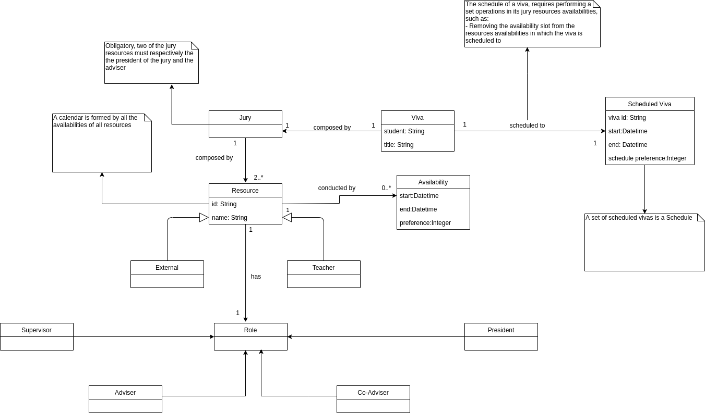
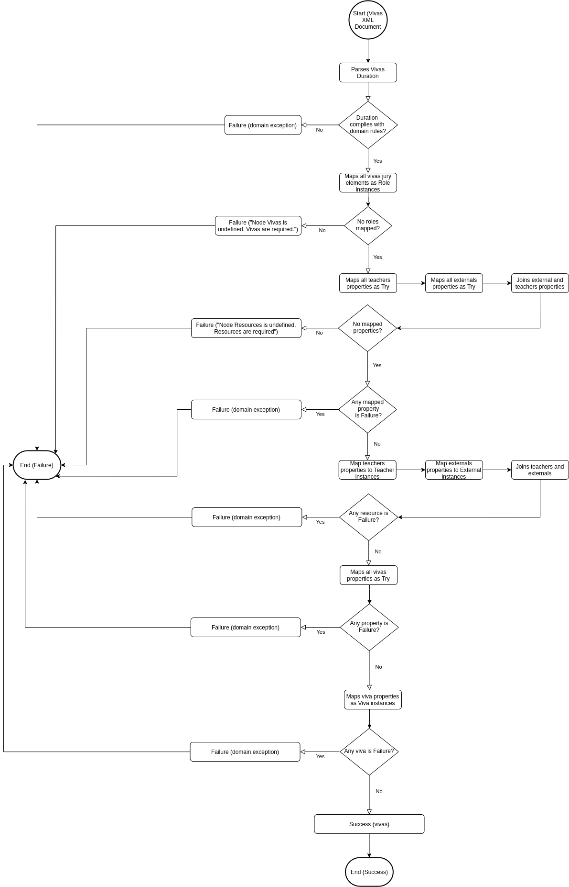
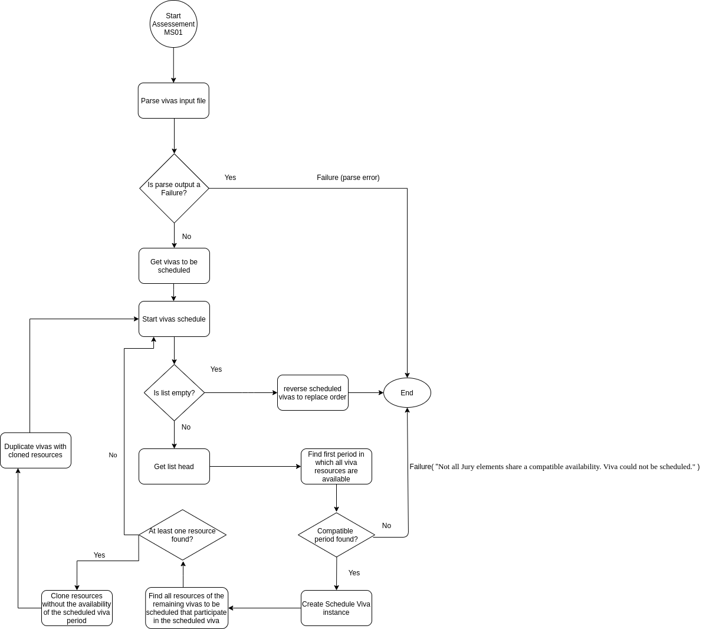

# Vivas Schedule

This repository holds the documentation and code of the project developed for TAP (Técnicas Avançadas de Programação) curricular unit of MEI (Mestrado em Engenharia Informática) at ISEP (Instituto Superior de Engenharia do Porto). It addresses the topic of the scheduling of MSc Disseration Defenses (entitled as Vivas) based on the availability of the jury participants (referenced as resources), following the functional programming paradigm.

The development was divided in three milestones, being the first one an MVP implementation of the scheduling algorithm, the second one the assurance of the domain correctness with the use of property-based tests and the third one, a refinement to the scheduling algorithm with resources availability maximation. Additionality, coding guidelines were also defined to in order to control the quality of the code and facilitate the communication between developers.

## Coding Guidelines

To improve the quality of the software being produced, one must adopt and define a set of coding rules that assemble the coding guidelines of the project. Not only these rules assure that the code being written follows specific patterns, it also improves the readability and comprehension of the code and thus facilitating the communication of the developers. Given this, the following rules have to be complied when writing code:

- Only write code that complies with the principle of [substitution model](http://bkpathak.github.io/scala-substitution-model). This means that functions cannot have side effects (e.g no var declarations, no exception throwing, no I/O) as they only work with what is given to them.
- Don't over-engineer. Think twice before designing and writing the code of your solution. Simple is difficult.
- Don't re-engineer. Whenever possible take advantage of Scala APIs.
- Design for reusability and maintainability with Functional Programming (FP) techniques such as High Order Functions (HOF) and Pattern Matching. In the same way that you pass functions as arguments in HOF, inject all non-function dependencies to your function via parameters. Always work with only that is the input of the function.
- Declare domain classes as ADT (Algebraic Data Types) and with the use of smart constructors validate the domain rules specific to the class. If the validation is successful return `Success` with the instance of the class else return `Failure` that embeds an `IllegalArgumentException` with a proper message that indicates the domain validation error.
- Unit test the conditions of your functions.
- Enhance your domain correctness with the use of property-based testing. Design exhaustive generators that match *real* (expected) data to test the behavior of your functions.
- Use [scalatest](http://www.scalatest.org/) as the unit testing framework.
- Use [scalacheck](https://www.scalacheck.org/) as the property-based testing framework.
- Use [Mockito](https://site.mockito.org/) for mocking dependencies and enhancing your test value and experience. Scalatest already provides [support for Mockito](http://www.scalatest.org/user_guide/testing_with_mock_objects#mockito) so take advantage of it.
- Adopt a TDD approach when implementing functional code. It eases the implementation so much, as with the tests already defined, **you know the inputs, outputs and behavior** of your functions, and with this you just need to adapt your implementation to support the expected behavior.
- Adopt the AAA (Arrange-Act-Assert) pattern when designing unit tests as it improves the readability and comprehension of the test by dividing the test body in three phases.
- Take advantage of the [Matchers](http://www.scalatest.org/user_guide/using_matchers) API of `scalatest` in unit tests as it improves the readability and comprehension of the test by providing a rich grammar of comparison connectors specific of the testing domain.
- Recur to [scala-xml](https://www.scala-lang.org/api/2.9.3/scala/xml/XML$.html) API for serializing, deserializing and manipulating XML documents.
- Recur to `LocalDateTime` and `OffsetDateTime` APIs for date and time representations and operations. They are well tested implementations and are compatible with scala-xml API.
- Use [sbt](https://www.scala-sbt.org/) as the build tool.
- Use [WartRemover](https://www.wartremover.org/) as the linter tool. It gives you very good insights regarding your code and how to improve it in the domain of functional programming.
- Use [Scala Style Guide](https://docs.scala-lang.org/style/) as the guide for project structure and naming conventions.
- Use [scalafmt](https://scalameta.org/scalafmt/) as the code formatter. IntelliJ provides support to instantly format your code while you write it. See this [document](https://scalameta.org/scalafmt/docs/installation.html#intellij) on how to setup it.

## Domain Concepts

After reading the project statement, it is possible to understand that the problem domain based on the scheduling of MSc Disserations Defenses, also known as Vivas. To schedule a Viva, one must take into account its properties, or else two viva schedules may overlap in their realization period. A Viva is held by a student in a specific time duration and addresses a certain topic. This topic is known as the viva title. The viva is assesed by a Jury, that implies the existence of at least two elements: the president of the jury and the adviser. Additonally the jury can also be composed by more elements, the co-advisers and supervisors of the student. Each of these elements is known as a resource that can either be a Teacher or an External. Teachers can take the role of president of the jury, adviser and coadviser, whereas externals can take the role of coadviser and supervisor. A resource is uniquely identifier by a string identifier and is known by a name. A resource is also conducted by a set of availability groups, which identify that the resource is available in a certain time slot. The resource can also give a preference for its availabilities. As seen in the domain model diagram below, the relationship between the jury as as whole and his elements, was represented by a composition of Resource instances, where each of instance is an abstraction of Teacher and External and has a set of roles. One could also depict this relationship as Jury is constituted by a President, Adviser, set of Co Advisers and Supervisors, without needing the abstraction of Resource, but that could lead to problems such as duplication of availabilities for each resource and the possibility of existing two vivas in which the resource that is identified as the jury president in viva X would be a supervisor in viva Y.

Once the vivas are defined, the algorithm can now be applied in order to schedule these into new instances of vivas. These new vivas also have an additional property that is the sum of the availability preferences in which the resources are available at the viva realization period. On schedule of a viva, it is required to also remove the availability periods of the jury elements, in which the viva will take on. The complete schedule of the vivas is also known as Agenda.



<center>Figure 1 - Domain Model represented in an UML Class Diagram</center>

## Domain validations

Having the domain concepts defined, we can start to translate these as Scala classes. As stated in the coding guidelines, in order to enhance and reinforce the domain identity, we design these classes as algebraic data types and validate the domain classes using smart constructors that instead of returning directly the instance of the domain object, they return a monad that indicates whether the domain was complied. This is achieved by using `Try` class. Additionally classes are declared using the `sealed` construct, which grants that all extensions of the classes are done in the file they are declared. With this we can restrain our domain by locking the contract of each concept.

The following table depicts the domain classes conceived and the validations associated to them:

|Class|Validations|
|-----|-----------|
|`Availability`| - Period length must be greater than zero - Preference must range between 1 and 5|
|`Teacher`| - ID must not be null or empty - Name must not be null or empty - Must not have duplicate availabilities - Must have at least one role - Must not have duplicate roles - Must not have the supervisor role|
|`External`| - ID must not be null or empty - Name must not be null or empty - Must not have duplicate availabilities - Must have at least one role - Must not have duplicate roles - Must not have the president role - Must not have the adviser role|
|`Jury`|- President resource must have the role of president - Adviser resource must have the role of adviser - Supervisor resources must have the role of supervisor - Coadviser resources must have the role of co adviser - Input resources must be unique|
|`Viva`| - Student name must not be null or empty - Title must not be null or empty - Duration length must not be negative or zero|
|`Scheduled Viva`| - Period length must be greater than zero - All viva resources must be available on the viva realization period|

## Vivas XML Document Parse

In order to schedule the vivas, one must have these as input in the first place. For this current project milestone, the intended vivas input was a XML document with a specific schema as seen in code snippet 1.

```
<agenda duration="HH:MM:SS">
  <vivas>
    <viva student="string" title="string">
      <president id="ID"/>
      <adviser id="ID"/>
      ...
      <supervisor id="ID"/>
      ...
      <coadviser id="ID"/>
      ...
    </viva>
  </vivas>
  <resources>
    <teachers>
      <teacher id="ID" name="string">
        <availability start="YYYY-MM-DDTHH:MM:SS" end="YYYY-MM-DDTHH:MM:SS" preference="integer ∈ [1, 5]"/>
      </teacher>
  </teachers>
    <externals>
      <external id="ID" name="string">
        <availability start="YYYY-MM-DDTHH:MM:SS" end="YYYY-MM-DDTHH:MM:SS" preference="integer ∈ [1, 5]"/>
      </external>
    </externals>
  </resources>
</agenda>
```

<center>Code Snippet 1 - Vivas input XML document structure</center>

In order to deserialize the input XML document as a list of vivas, it is first necessary to analyze the document elements composition. As seen in the code snippet above, first is declared the vivas to be scheduled, with their jury elements and then the resources information that correspond to the vivas jury elements. From this we can affirm that there is a dependency between the viva jury elements and the declared resources elements, as the jury elements are referencing the resources roles. From the domain design, we can also affirm that there is a dependency between vivas and resources, as to create a viva, one must know before the resouces that compose the viva jury. This means that, before deserializing the vivas, first we need to deserialize the resources elements and to deserialize these we need to deserialize the jury elements (`Vivas <- Resources <- Jury elements`). Also, as the information of the XML document may not comply with the domain rules, it is also necessary to take into account the failure states. As we are taking advantage of smart constructors that give us instances of `Try` objects, we easily check the state of each parsing phase using pattern matching. As seen in Figure 2, the parser starts by retrieving the vivas duration string and deserializes it as a `Duration` instance. We do this as its a required input for each viva, that must be parsed before their deserialization. Once the duration state is verified, we can go proceed to the next phase, which is the deserialization of the vivas jury elements as role instances. Using scala-xml API this is easily achieved by traversing the XML viva nodes, and then based on the descendant elements label of each node, we can use pattern matching to identify and instantiate the respective role. We map each of these roles by the `id` attribute, so we can later identify the roles of each resource. Having the roles of the resources identified, we can now move on to the next phase which is the resources deserialization. Following the same approach as roles phase, the `teachers` and `externals` nodes are traversed. The first step is to collect and validate their remaining properties. Once all of these properties are validated, they are mapped into `Teacher` and `External` instances. As more validations are necessary on instance creation, these mapped instances are also validated. Finally we move on to the last phase, which is to deserialize the vivas nodes and map the gathered resources to the respective vivas in which they participate as part of the jury. If these instances are valid, the parser completes with success, returning the list of vivas to be scheduled.



<center>Figure 2 - Vivas XML Document Parse Flow Chart represented in a General Purpose Diagram</center>

## Vivas Scheduling Algorithm (MS01)

For this milestone, the vivas scheduling requirements are that these vivas must be scheduled in a FCFS manner and that if one viva fails to be scheduled, then the complete scheduled is considered invalid. This means that depending on the order of the input, different scheduling can be generated. The parser previously presented already grants this, so what we need to do know is to map these vivas as scheduled vivas. As seen in the flowchart below, after successfully parsing the vivas input XML document, we move to the first state of the scheduled vivas creation. Then, the current vivas input list emptiness is verified. If this verification fails, it means that more vivas need to be scheduled, so the first viva of the list is choosed for schedule, in order to respect the FCFS constraint. Based on this viva, the first time period in which the jury elements are available is tried to be found. The way this search is performed is based on the resources availabilities. We start by joining all resources availabilities in a list, sort these in ascendant order and then map them as periods of time, in which the start date time is the period start time and the end date time is the sum of the period start date time with the viva duration. Finally, for each of these period of times, a period in which all resources are available on, is tried to be found. If not found, the algorithm ends as it fails to comply with the proposed requirements. If found, a scheduled viva instance is created. Based on this, all resources of the remaining vivas to be scheduled that participate in the viva are searched. If no resources are found, then the vivas algorithm is started again, with the remaining vivas list as the input. If resources are found, then these are cloned without the availability of the scheduled viva period, as well as the vivas in which they participate. This is done as it is a domain requirement to remove the availability of the resource in which the scheduled viva interval occurs, and to comply with the immutability principle. Based on the updated cloned vivas, and the vivas that did not got cloned, the scheduling algorithm is started again with these vivas as input. Whenever the vivas input list is empty, then the algorithm successfully ends.

### Future Improvements

Looking ahead into feature developments, we consider that further improvements could be done. Although these changes wouldn't improve the correctness of the program and what it intends to do, it would definitely improve the readiness of the code. One change would be the usage of the "for comprehension" notation in the parser code. This improvement in the code readiness would be a welcome change for future members that develop in this code base, improving it's speed of learning and consequent improve of speed in development. Another possible change would be the usage of pattern matching in the domain classes to match the scala guidelines. Regarding to performance, the addition of load tests would be welcome, in order to understand the magnitude of usability of the current algorithm. This would allow us to understand the answer to some of the following questions: How many vivas can we schedule in an hour? Can we schedule the entire vivas of Portugal in usable time? What about the United States? The answer to these questions could lead into looking to performance improvements, checking optimizations on lists operations, and other code improvements. 



<center>Figure 3 - FCFS Vivas Scheduling Algorithm Flow Chart represented in a General Purpose Diagram</center>

## Domain Correctness Assurance with Property-Based Testing (MS02)

## Scheduling Algorithm Refinement with Resource Availability Preference Optimization (MS03)

### Team Members

`Gustavo Moreira 1130604@isep.ipp.pt`

`João Freitas 1160907@isep.ipp.pt`